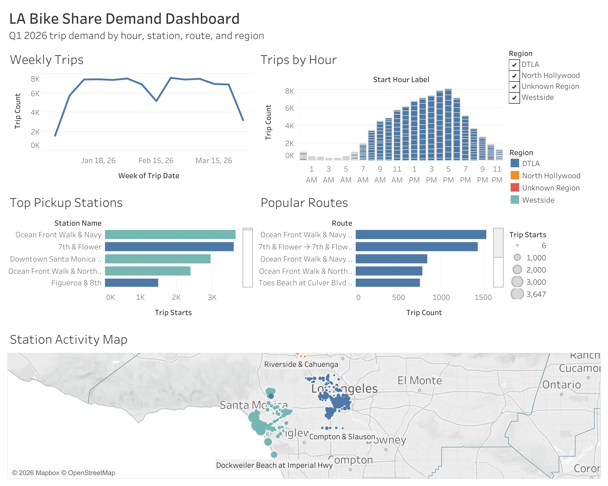

# LA Metro Bike Share Analytics Pipeline

An end-to-end data engineering project using LA Metro Bike Share data to analyze station demand, trip patterns, and first-mile/last-mile mobility behavior in Los Angeles.

## Project Highlights

- Built a local batch data pipeline using public LA Metro Bike Share data
- Ingested quarterly raw CSV files into a partitioned Parquet data lake
- Loaded cleaned data into a DuckDB analytical warehouse
- Created SQL staging and mart tables for hourly demand, station activity, and route popularity
- Exported reporting tables for a Tableau Public dashboard
- Added Docker, Kestra orchestration, and warehouse validation checks

Dashboard: [LA Metro Bike Share Demand Dashboard](https://public.tableau.com/shared/2S5YQT764?:display_count=n&:origin=viz_share_link)

## Problem Statement

Transportation and venue operations teams need reliable mobility data to understand how people move through a city. This project builds a pipeline that ingests LA Metro Bike Share trip data, cleans and transforms it, and produces analytics tables for dashboard reporting.

Key questions:
- Which stations have the highest trip demand?
- What days and hours are busiest?
- Which station-to-station routes are most common?
- How do different passholder types use the system?
- What patterns could help transportation or event operations teams plan better?

## Data Source

LA Metro Bike Share public trip data:

https://bikeshare.metro.net/about/data/

See `docs/data_sources.md` for the exact raw files used by this project.

## Planned Architecture

```text
Raw quarterly CSV files
    -> Python ingestion
    -> Partitioned Parquet data lake
    -> DuckDB warehouse
    -> SQL staging models
    -> SQL mart models
    -> CSV exports
    -> Tableau dashboard
```

See `docs/architecture.md` for a more detailed explanation of each pipeline layer.

## Tech Stack
- Python
- Pandas
- PyArrow
- DuckDB
- SQL
- Tableau Public
- Streamlit
- Kestra

## Docker Run

The pipeline can be run in Docker after the raw Metro Bike Share files have been downloaded into `data/raw`.
Trip ingestion reads all files matching `data/raw/metro-trips-*.csv` and writes partitioned Parquet files under `data/lake/trips`.
It also updates `data/manifest/trip_ingestion_manifest.json` with the processed source files, row counts, output paths, and ingestion timestamps.

Build the image:

```bash
docker compose build
```

Download any missing quarterly trip files from the Metro Bike Share data page:

```bash
docker compose run --rm pipeline python ingestion/download_trip_data.py
```

Run the full local pipeline:

```bash
docker compose run --rm pipeline ./scripts/run_pipeline.sh
```

This runs:

```text
ingestion/ingest_trips.py
ingestion/ingest_stations.py
warehouse/build_warehouse.py
export/export_tableau_csvs.py
```

## Data Checks

After running the pipeline, validate the warehouse tables:

```bash
docker compose run --rm pipeline python tests/check_warehouse.py
```

## Orchestration

The Kestra flow in `orchestration/flows/la_bike_share_pipeline.yaml` defines a scheduled batch refresh that can safely run repeatedly.
It checks the Metro Bike Share data page for missing quarterly trip files before rebuilding the local lake and warehouse.

```text
download missing trip files
ingest trips
ingest stations
build DuckDB warehouse
run warehouse checks
export Tableau CSV files
```

The warehouse checks run before export so dashboard extracts are only refreshed after the warehouse passes validation.

## Dashboard

The Tableau dashboard visualizes the reporting marts exported by the pipeline.

Dashboard link: [LA Metro Bike Share Demand Dashboard](https://public.tableau.com/shared/2S5YQT764?:display_count=n&:origin=viz_share_link)

The dashboard includes:

- hourly demand patterns
- weekly trip trends
- busiest pickup stations
- station activity map
- most popular station-to-station routes



## Streamlit App

The Streamlit app reads directly from the DuckDB warehouse and provides an interactive batch analytics view across all ingested quarters:

```bash
docker compose up streamlit
```

Then open:

```text
http://localhost:8501
```

## Future Improvements

- Add a venue proximity layer for major Los Angeles event locations, transit hubs, and future LA 2028 Olympic venues to compare bike share access across the city.
- Extend the pipeline to run on a quarterly schedule as new trip data is released, allowing demand trends to be compared over time.
